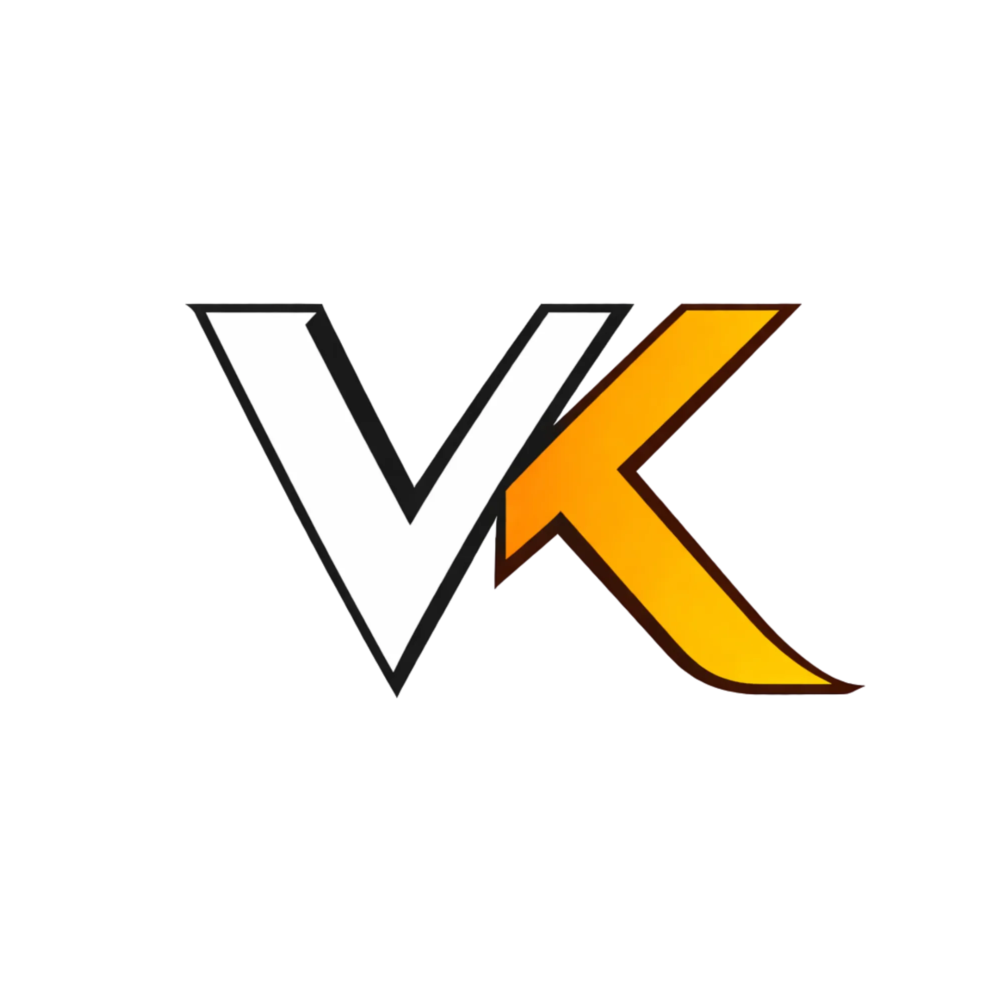
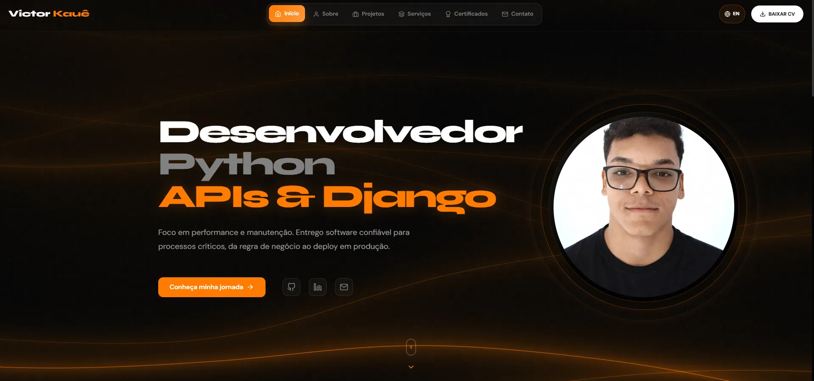
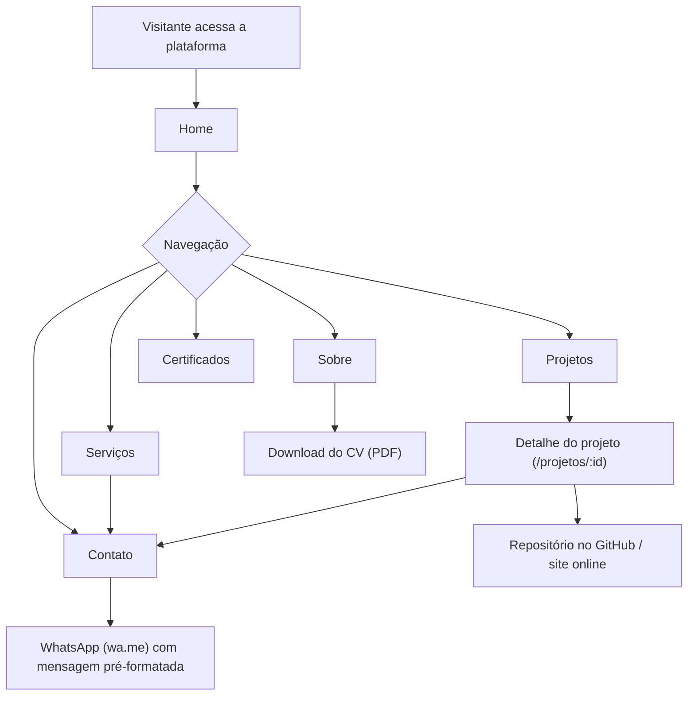
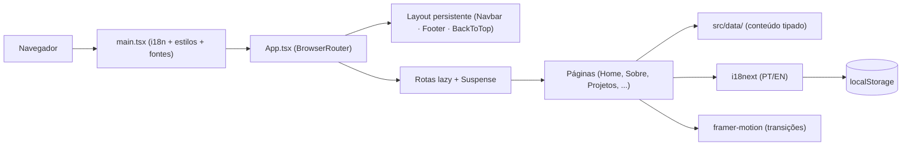
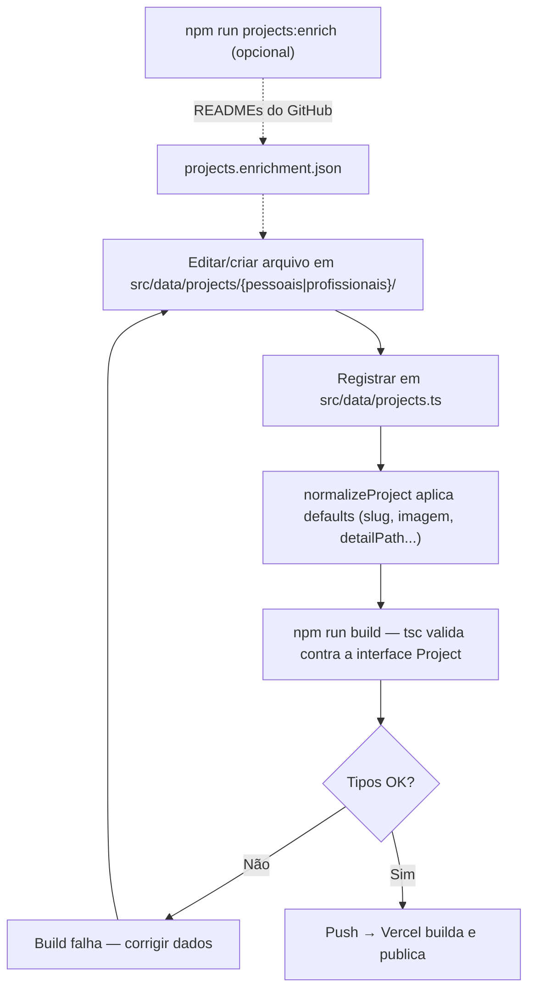
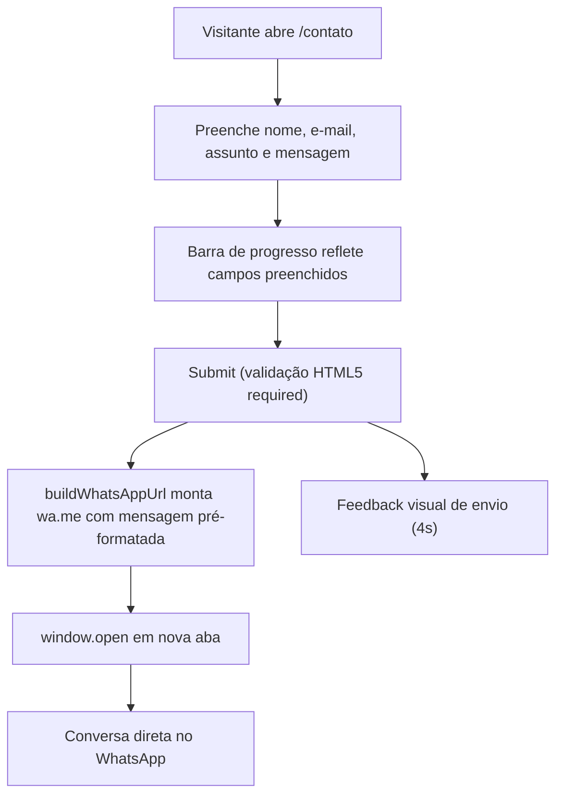
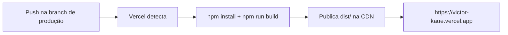

<div align="center">



### Portfólio Full Stack de Victor Kauê

SPA premium, bilíngue (PT/EN) e responsiva, construída para demonstrar capacidade técnica em
**desenvolvimento web full stack** — backend (Python/Django) como especialidade e
**front-end React de alto acabamento** como vitrine.

<br />

[](https://victor-kaue.vercel.app/)
[](docs/CHANGELOG.md)

[](https://react.dev/)
[](https://www.typescriptlang.org/)
[](https://vite.dev/)
[](https://tailwindcss.com/)
[](https://www.framer.com/motion/)
[](https://threejs.org/)
[](https://www.i18next.com/)
[](https://vercel.com/)

🌐 **Produção:** **<https://victor-kaue.vercel.app/>**

</div>

---

## Sumário

- [1. Sobre o projeto](#1-sobre-o-projeto)
- [2. Demonstração / Produção](#2-demonstração--produção)
- [3. Principais funcionalidades](#3-principais-funcionalidades)
- [4. Páginas da aplicação](#4-páginas-da-aplicação)
- [5. Fluxo geral de navegação](#5-fluxo-geral-de-navegação)
- [6. Arquitetura](#6-arquitetura)
- [7. Fluxo do frontend](#7-fluxo-do-frontend)
- [8. Fluxo de conteúdo (dados como código)](#8-fluxo-de-conteúdo-dados-como-código)
- [9. Fluxo de contato](#9-fluxo-de-contato)
- [10. Stack de tecnologias](#10-stack-de-tecnologias)
- [11. Estrutura do projeto](#11-estrutura-do-projeto)
- [12. Como executar localmente](#12-como-executar-localmente)
- [13. Variáveis de ambiente](#13-variáveis-de-ambiente)
- [14. Comandos úteis](#14-comandos-úteis)
- [15. Testes](#15-testes)
- [16. Deploy](#16-deploy)
- [17. SEO, performance e acessibilidade](#17-seo-performance-e-acessibilidade)
- [18. Roadmap](#18-roadmap)
- [19. Documentação complementar](#19-documentação-complementar)
- [20. Autor](#20-autor)
- [21. Contato](#21-contato)

---

## 1. Sobre o projeto

Este portfólio é uma **SPA React (single-page application) totalmente estática**, projetada
para converter visitantes — recrutadores, clientes e comunidade técnica — em contatos
qualificados. É um projeto **real e em produção**, e a própria aplicação funciona como prova
de competência: arquitetura por camadas, código 100% TypeScript, i18n com persistência,
animações fluidas, elementos 3D e deploy contínuo.

Três públicos, três jornadas:

- **Recrutadores** avaliam trajetória, stack e projetos em poucos minutos e baixam o **CV em PDF**.
- **Clientes potenciais** conhecem os **serviços** e iniciam conversa direta via **WhatsApp**.
- **Comunidade técnica** explora o detalhe de cada projeto: desafio, solução, impacto e decisões de arquitetura.

Tecnicamente, **não há backend nem banco de dados**: todo o conteúdo (projetos, experiências,
certificados, serviços) vive como **módulos TypeScript tipados** em `src/data/`, validados em
build e compilados no bundle. **O repositório é a fonte de verdade do conteúdo.**

> O contexto de negócio (problema, personas, métricas e escopo) está em
> [`PROJECT_CONTEXT.md`](PROJECT_CONTEXT.md); os requisitos (RF/RNF), fluxos e critérios de
> aceite em [`docs/PRD.md`](docs/PRD.md).

---

## 2. Demonstração / Produção

🌐 **Ambiente de produção:** <https://victor-kaue.vercel.app/>



<!--
  Para adicionar mais screenshots: exportar em .webp, colocar em public/images/readme/
  e referenciar aqui. Ex.:

  
  
-->

---

## 3. Principais funcionalidades

### 🧭 Navegação e experiência

- [x] SPA com **transições animadas** entre rotas (framer-motion + `AnimatePresence`)
- [x] **Lazy loading por rota** com `Suspense` e loaders customizados (primeira visita + navegação)
- [x] Fundo com **elementos 3D** (three.js / React Three Fiber) carregado de forma preguiçosa
- [x] Scroll gerenciado: volta ao topo ao trocar de rota + botão "voltar ao topo"
- [x] Navbar desktop + **navbar mobile dedicada**, tema dark premium com design tokens

### 🌐 Conteúdo e internacionalização

- [x] **PT/EN** com i18next; idioma detectado e **persistido em `localStorage`**
- [x] Catálogo de projetos com **filtro por categoria** (Todos / Pessoais / Profissionais)
- [x] Página de **detalhe por projeto**: desafio, solução, impacto, arquitetura, stack e screenshots
- [x] Experiências, formação, expertise e serviços renderizados a partir de **dados tipados**
- [x] **Certificados** com visualização e PDFs para download
- [x] **Download do currículo** em PDF

### 📬 Conversão

- [x] Formulário de contato com barra de progresso e validação
- [x] Envio via **deep-link do WhatsApp** com mensagem pré-formatada (sem backend)
- [x] Links sociais (GitHub, LinkedIn, e-mail, WhatsApp) em toda a aplicação

---

## 4. Páginas da aplicação

Sete rotas públicas — não há autenticação nem perfis (todo o conteúdo é aberto):

| Rota | Página | Conteúdo |
|---|---|---|
| `/` | **Home** | Hero, destaques, marquee de tecnologias e CTAs |
| `/sobre` | **Sobre** | Trajetória, experiências, formação e expertise |
| `/projetos` | **Projetos** | Catálogo com filtro por categoria |
| `/projetos/:id` | **Detalhe do projeto** | Desafio, solução, impacto, arquitetura e stack |
| `/servicos` | **Serviços** | Ofertas de desenvolvimento e consultoria |
| `/certificados` | **Certificados** | Certificações com PDFs |
| `/contato` | **Contato** | Formulário → WhatsApp + links sociais |

---

## 5. Fluxo geral de navegação



---

## 6. Arquitetura

Visão geral; detalhes completos em [`docs/ARCHITECTURE.md`](docs/ARCHITECTURE.md).

```
Browser (SPA)
   │  HTTPS  →  https://victor-kaue.vercel.app  (arquivos estáticos)
   ▼
Vercel (CDN + fallback SPA)
   └─ dist/  ←  npm run build (tsc -b + vite build)
                   │
                   ├─ src/pages/      rotas lazy (Home, Sobre, Projetos, ...)
                   ├─ src/components/ Layout persistente + ui reutilizável
                   ├─ src/data/       conteúdo tipado (bundled — sem fetch em runtime)
                   └─ src/i18n.ts     PT/EN (persistência em localStorage)
```

**Pontos-chave:**

- **Zero backend** — nenhuma API própria, nenhum banco: hospedagem estática, superfície de
  ataque mínima e custo zero de infraestrutura.
- **Conteúdo como código** — dados em `.ts` validados pela interface `Project`
  (`src/types/index.ts`) e normalizados em `src/data/projects.ts`; erro de contrato quebra o
  build, nunca a produção.
- **Contato sem servidor** — o formulário monta um deep-link `wa.me` com a mensagem
  pré-formatada; não há e-mail transacional nem armazenamento de mensagens.
- **Bundle otimizado** — code-splitting por rota + `manualChunks` para vendors
  (react, motion, i18n, icons) no `vite.config.ts`.

Integrações externas: WhatsApp (`wa.me`), GitHub/LinkedIn (links), CDN devicon (ícones) e —
apenas em build-time — `raw.githubusercontent.com` via script de enriquecimento
(ver [`docs/API.md`](docs/API.md)).

---

## 7. Fluxo do frontend

O frontend é uma **SPA construída com React 19, Vite e TypeScript**. O fluxo básico:

1. O navegador carrega `index.html` → `src/main.tsx` (fontes, estilos globais, i18n).
2. `App.tsx` monta o `BrowserRouter`, o layout persistente (Navbar, Footer, MobileNavbar,
   BackToTop) e o fundo 3D (`FloatingLines`, lazy).
3. O **React Router** resolve a rota; cada página é um chunk **lazy** com `Suspense` + loader.
4. As páginas consomem conteúdo **exclusivamente de `src/data/`** (módulos tipados).
5. Textos passam pelo **i18next** (`t()`); o idioma persiste em `localStorage` (`portfolio-lang`).
6. Transições de página são orquestradas pelo **framer-motion** (`AnimatePresence`).



---

## 8. Fluxo de conteúdo (dados como código)

Não há CMS nem banco: atualizar o portfólio = editar dados tipados e fazer push.



Modelo de conteúdo completo (entidades, campos e relações) em [`docs/DATABASE.md`](docs/DATABASE.md).

---

## 9. Fluxo de contato

Sem servidor de e-mail: o formulário converte a mensagem em deep-link do WhatsApp.



Contrato do deep-link documentado em [`docs/API.md`](docs/API.md).

---

## 10. Stack de tecnologias

Versões reais em [`package.json`](package.json).

### Frontend

| Tecnologia | Função |
|---|---|
| **React 19** + React DOM | Construção da interface |
| **TypeScript ~5.7** | Tipagem estática (strict) |
| **Vite 6** | Build e desenvolvimento |
| **TailwindCSS 4** (`@tailwindcss/vite`) + `tw-animate-css` | Estilização utilitária |
| CSS por componente + design tokens (`src/styles/variables.css`) | Tema dark premium |
| **react-router-dom 7** | Roteamento SPA com lazy routes |
| **framer-motion 12** | Animações e transições de página |
| **three** + `@react-three/fiber` + `@react-three/drei` | Elementos 3D do fundo |
| **i18next** + `react-i18next` + language detector | Internacionalização PT/EN |
| `radix-ui` + shadcn + `cva` + `clsx` + `tailwind-merge` | Base de componentes acessíveis |
| `lucide-react` · `react-icons` · `devicon` | Ícones |
| `@fontsource` (Syne, DM Sans, Orbitron) | Fontes self-hosted |
| `axios` | Cliente HTTP |

### Build / Infra

| Tecnologia | Função |
|---|---|
| **Vercel** | Hospedagem estática + deploy contínuo por push |
| `tsc -b` + `vite build` | Checagem de tipos + bundle de produção |
| `manualChunks` (react, motion, i18n, icons) | Split de vendors para cache eficiente |
| Node.js (`scripts/enrich-projects.mjs`) | Enriquecimento de projetos em build-time |

---

## 11. Estrutura do projeto

```
meu_portifolio/
├── public/
│   ├── Certificados/pdfs/         # PDFs de certificados (+ capas .webp)
│   ├── docs/Curriculo/            # Currículo em PDF
│   └── images/                    # fotos de projetos, galeria, backgrounds (.webp)
├── scripts/
│   └── enrich-projects.mjs        # busca READMEs no GitHub → projects.enrichment.json
├── src/
│   ├── components/
│   │   ├── Layout/                # Navbar, MobileNavbar, Footer, BackToTop, loaders
│   │   └── ui/                    # Button, PageHero, ProjectCard, TechMarquee, 3D…
│   ├── data/
│   │   ├── projects/pessoais/     # um arquivo .ts por projeto pessoal
│   │   ├── projects/profissionais/# um arquivo .ts por projeto profissional
│   │   └── *.ts                   # experiences, education, expertise, services, social…
│   ├── hooks/                     # useScrollPosition, useLanguage…
│   ├── pages/                     # uma pasta por rota (.tsx + .css)
│   ├── styles/                    # variables, reset, global, animations
│   ├── types/index.ts             # contratos (Project, Experience, …)
│   ├── i18n.ts                    # recursos PT/EN + detecção de idioma
│   ├── App.tsx  main.tsx
│   └── vite-env.d.ts
├── docs/                          # documentação técnica (padrão de 11 documentos)
├── CLAUDE.md · PROJECT_CONTEXT.md
├── index.html · vite.config.ts · tsconfig*.json
└── README.md                      # você está aqui
```

| Pasta | O que contém |
|---|---|
| `src/data/` | **Fonte de verdade do conteúdo** — módulos TS tipados, sem fetch em runtime |
| `src/components/` | Layout persistente e blocos de UI reutilizáveis (um componente por pasta) |
| `src/pages/` | Uma pasta por rota; monta seções e consome `src/data/` |
| `public/` | Assets estáticos: imagens `.webp`, PDFs de certificados e currículo |
| `scripts/` | Utilitários Node de build-time |
| `docs/` | Documentação viva (arquitetura, dados, deploy, ambiente…) |

---

## 12. Como executar localmente

**Pré-requisitos:** Node.js 18+ (LTS recomendado) · npm · Git.
Sem Docker, sem banco, sem chaves — clona e roda.

```bash
# 1. Clonar o repositório
git clone https://github.com/Victorkaue333/Portifolio-VictorKaue.git
cd Portifolio-VictorKaue

# 2. Instalar dependências
npm install

# 3. Rodar em desenvolvimento
npm run dev
```

- App: <http://localhost:3000> (abre automaticamente)

> Build de produção local: `npm run build` e depois `npm run preview`.

---

## 13. Variáveis de ambiente

**Nenhuma.** A aplicação não consome variáveis de ambiente em runtime — todo o conteúdo é
estático e compilado no bundle. Clonou, instalou, rodou.

| Variável | Obrigatória | Observação |
|---|---|---|
| — | Não | O app não lê `import.meta.env.VITE_*` em nenhum ponto |

> ⚠️ Os arquivos `.env` / `.env.example` presentes na raiz são resíduos de tooling externo e
> **não são usados pelo app**. Detalhes e recomendação de limpeza em
> [`docs/ENVIRONMENT.md`](docs/ENVIRONMENT.md).

---

## 14. Comandos úteis

Scripts reais de [`package.json`](package.json):

| Comando | Descrição |
|---|---|
| `npm run dev` | Inicia o Vite em modo desenvolvimento (porta 3000) |
| `npm run build` | `tsc -b && vite build` (checagem de tipos + build de produção) |
| `npm run preview` | Serve o build de produção localmente |
| `npm run projects:enrich` | Busca READMEs dos repositórios e gera `src/data/projects.enrichment.json` |

---

## 15. Testes

**Não há suíte de testes automatizados** (é um roadmap declarado — ver [§18](#18-roadmap)).
A validação atual tem três camadas manuais:

| Camada | Ferramenta | Como rodar |
|---|---|---|
| Contratos de dados / tipos | **TypeScript strict** (`tsc -b`) | `npm run build` — erro de tipo quebra o build |
| Validação visual | Dev server / preview | `npm run dev` · `npm run preview` |
| Performance / SEO | **Lighthouse** (manual) | DevTools sobre a URL de produção |

---

## 16. Deploy

Produção na **Vercel** com deploy contínuo por push. Guia completo em
[`docs/DEPLOY.md`](docs/DEPLOY.md).



- **Build command:** `npm run build` · **Output:** `dist/`
- **Rollback:** dashboard Vercel → *Deployments* → **Promote to Production** em um deploy
  anterior (instantâneo, sem rebuild).
- **Roteamento SPA:** `BrowserRouter` exige fallback para `index.html` em rotas profundas
  (ex.: `/projetos/:id`); a Vercel aplica automaticamente em projetos Vite — se surgir 404 em
  rota direta, adicionar o `vercel.json` documentado em [`docs/DEPLOY.md`](docs/DEPLOY.md).

---

## 17. SEO, performance e acessibilidade

- **SEO:** meta description/keywords, **Open Graph** e **Twitter Card** configurados em
  [`index.html`](index.html); título por página via `document.title`.
- **Performance:** lazy loading por rota, `manualChunks` para vendors, imagens `.webp`,
  fontes self-hosted (`@fontsource`) e 3D carregado fora do caminho crítico.
- **Acessibilidade:** componentes base acessíveis (radix), `aria-*` em ícones e controles,
  navegação por teclado e contraste do tema dark.
- **Alvo:** Lighthouse ≥ 90 em Performance e SEO (aferição manual — ver [`docs/PRD.md`](docs/PRD.md), RNF-02).

---

## 18. Roadmap

Itens em evolução — **não** são funcionalidades já concluídas:

- Testes automatizados (unitários com Vitest; E2E com Playwright);
- Analytics de visitas e conversão (hoje as métricas são qualitativas);
- Limpeza do `.env.example` legado (ver [`docs/DECISIONS.md`](docs/DECISIONS.md), ADR-0002);
- `vercel.json` explícito com rewrite SPA;
- Novos projetos no catálogo e screenshots adicionais no README;
- Melhorias contínuas de acessibilidade.

---

## 19. Documentação complementar

Este repositório segue o padrão de **11 documentos obrigatórios**: documentos vivos,
versionados junto ao código.

**Na raiz:**

| Documento | Conteúdo |
|---|---|
| [PROJECT_CONTEXT](PROJECT_CONTEXT.md) | Contexto de negócio: problema, personas, métricas e escopo |
| [CLAUDE](CLAUDE.md) | Regras para a IA: stack, comandos, convenções e guardrails |

**Em [`docs/`](docs/):**

| Documento | Conteúdo |
|---|---|
| [PRD](docs/PRD.md) | Produto, requisitos (RF/RNF), fluxos e critérios de aceite |
| [ARCHITECTURE](docs/ARCHITECTURE.md) | Arquitetura da SPA, camadas e integrações |
| [API](docs/API.md) | Contratos externos (WhatsApp, enriquecimento GitHub) — sem API própria |
| [DATABASE](docs/DATABASE.md) | Modelo de conteúdo estático (entidades e relações) |
| [DEPLOY](docs/DEPLOY.md) | Vercel, pipeline, rollback e checklist |
| [ENVIRONMENT](docs/ENVIRONMENT.md) | Variáveis de ambiente (nenhuma) + aviso sobre `.env` legado |
| [DECISIONS](docs/DECISIONS.md) | Decisões técnicas (ADRs) e histórico |
| [CHANGELOG](docs/CHANGELOG.md) | Histórico de mudanças por versão (SemVer) |

---

## 20. Autor

<table>
  <tr>
    <td align="center" width="220">
      <a href="https://github.com/Victorkaue333">
        
      </a>
      <br /><sub><b>Victor Kauê</b></sub>
      <br /><sub>Full Stack · Backend (Python/Django) · APIs</sub>
    </td>
  </tr>
</table>

Desenvolvedor full stack com foco em backend, APIs e sistemas web escaláveis. Formado em
Desenvolvimento de Sistemas e graduando em Gestão da Tecnologia da Informação. Este portfólio
é, ele próprio, uma demonstração do compromisso com excelência técnica e experiência do usuário.

Convenção de commits: **Conventional Commits** (`feat:`, `fix:`, `docs:`, …).

---

## 21. Contato

[](https://github.com/Victorkaue333)
[](https://www.linkedin.com/in/victor-kaue-419926364/)
[](mailto:kaue.alves.pg@gmail.com)
[](https://wa.me/5587981677005)

---

<div align="center">

> 🚀 Documento vivo — mantido junto ao código. Última revisão alinhada à v2.0.0.

</div>
