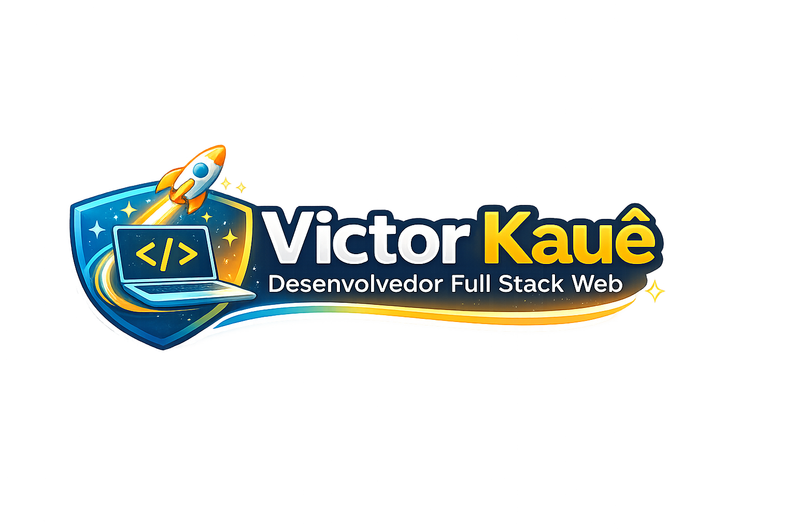
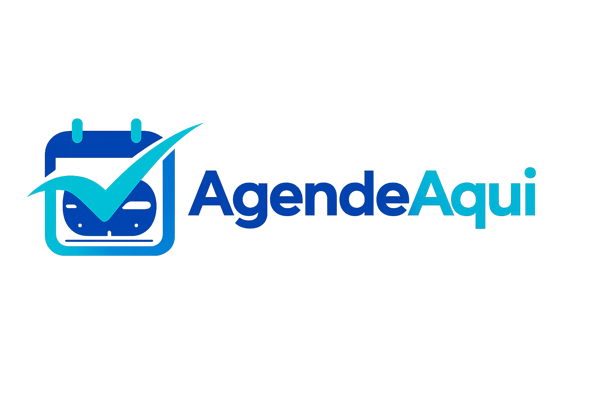
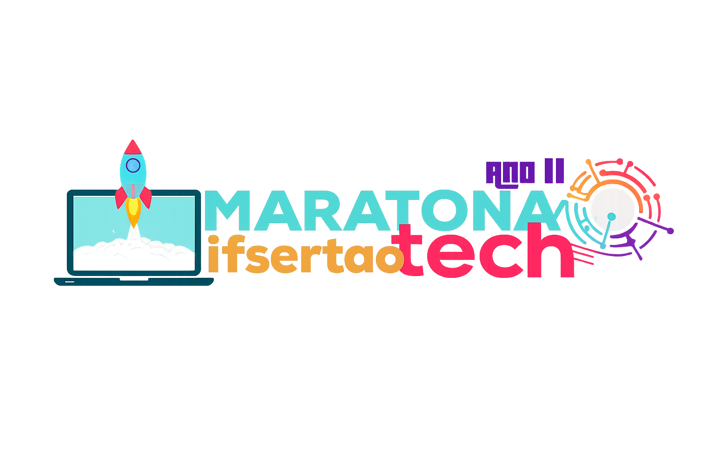

# Portfólio Pessoal - Victor Kauê

💼 Portfólio profissional desenvolvido para apresentar projetos, experiência, serviços e formas de contato de maneira moderna, responsiva e objetiva.

## Preview

### Home do Portfólio



### Projeto Pessoal - AgendeAqui



### Projeto Real - MaratonaTech



## Visão Geral

📌 Este projeto foi construído para funcionar como vitrine profissional, com foco em:

- 🚀 apresentação de projetos pessoais e reais;
- 🎯 fortalecimento de posicionamento profissional;
- 🤝 navegação clara para recrutadores e clientes;
- 📱 experiência visual consistente em desktop, tablet e mobile;

## Funcionalidades

- ✨ Hero com CTA principal e destaque de stack;
- 🧭 Navbar com menu responsivo;
- 🧠 Seções institucionais (Sobre e Serviços);
- 🗂️ Catálogo de projetos com cards e detalhes;
- 🖼️ Galeria de imagens com modal/lightbox;
- 🏆 Página de certificados;
- 📩 Formulário de contato com feedback visual;
- ⬆️ Botão de voltar ao topo;
- 🎬 Animações e transições suaves (quando aplicável);

## Tecnologias

### Icones (SVG)


### Icones das tecnologias usadas


| Tecnologia | Uso no projeto |
| --- | --- |
| HTML5 | Estrutura semântica das páginas |
| CSS3 | Estilização modular e responsividade |
| JavaScript (Vanilla) | Interações e comportamento da interface |
| GSAP | Animações de entrada e destaque de seções |
| Typed.js | Efeito de digitação (quando o alvo está presente) |
| Lucide Icons | Ícones da interface |
| Devicon | Ícones de stack tecnológica |
| Bootstrap Icons | Ícones adicionais em seções de contato e apoio |

## Estrutura do Projeto

```text
meu_portifolio/
├── index.html
├── sobre.html
├── servicos.html
├── projetos.html
├── certificados.html
├── galeria.html
├── contato.html
├── css/
│   ├── main.css
│   ├── custom.css
│   ├── base/
│   ├── components/
│   ├── layouts/
│   ├── pages/
│   └── responsive/
├── js/
│   ├── app.js
│   ├── main.js
│   └── carrosel.js
├── images/
├── projetos-pessoais/
├── projetos-reais/
├── docs/
└── README.md
```

## Como Executar Localmente

⚙️ Como se trata de um projeto estático, voce pode executar de duas formas:

1. 🌐 Abrindo o arquivo `index.html` diretamente no navegador.
2. 🛠️ Usando um servidor local (recomendado), por exemplo com a extensao Live Server no VS Code.

### Clonando o repositorio

```bash
git clone https://github.com/Victorkaue333/Portifolio-VictorKaue.git
cd Portifolio-VictorKaue
```

### Rodando com Live Server (VS Code)

1. Instale a extensao Live Server.
2. Clique com o botao direito em `index.html`.
3. Selecione a opcao Open with Live Server.

## Páginas Principais

| Página | Finalidade |
| --- | --- |
| index.html | Página inicial com apresentação principal |
| sobre.html | Resumo profissional, trajetória e diferenciais |
| servicos.html | Serviços oferecidos e propostas de atuação |
| projetos.html | Lista de projetos em destaque |
| certificados.html | Certificações e formações |
| galeria.html | Galeria visual de trabalhos e registros |
| contato.html | Canais de contato e formulário |

## Deploy

- Vercel: [https://victor-kaue.vercel.app/](https://victor-kaue.vercel.app/)

---

👨‍💻 Desenvolvido por Victor Kauê.
